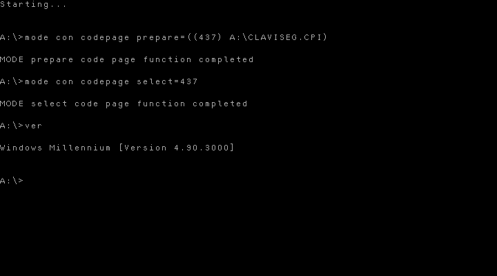
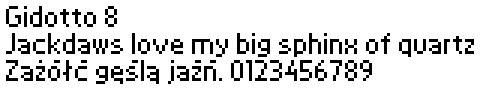

This repository contains some raster fonts created by me over the years.
Currently, it's only Clavis (monospaced) and Gidotto (proportional).

# Clavis
Clavis Regular font created initially for my own operating system project.
Currently it supports only `437` (US-ASCII) and `852` (DOS-Central Europe) code pages.



## Building
To build binary font files, make, Python and monobit are needed.

```sh
python -m venv venv
source venv/bin/activate
pip install monobit
make clavis
```

## Installation in MS-DOS
Copy `clavis.cpi` to the DOS files path (`C:\DOS` in this example) and then add these lines to `autoexec.bat`:

```
mode con codepage prepare=((<code page>) C:\DOS\CLAVIS.CPI)
mode con codepage select=<code page>
````

Remember that currently only 437 and 852 code pages are supported.

# Gidotto
Gidotto is a proportional bitmap font, 8 pixels high, created for Demistar event signage system. It is loosely inspired by Gidole.


